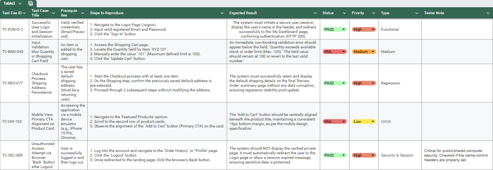
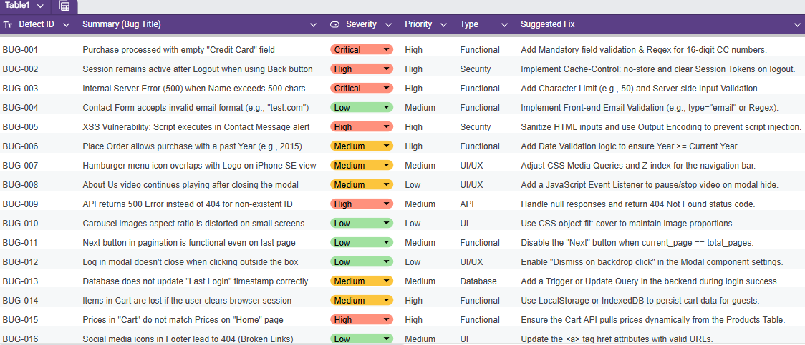

# 🚀 Demoblaze E-commerce - Quality Assurance Portfolio ✨

  
  
  

---

## 📌 Project Overview
This repository contains a full **Manual Testing Lifecycle** applied to the **Demoblaze** platform. It demonstrates a professional transition from requirement analysis to comprehensive defect reporting with technical fixes.

---

## 📁 Portfolio Documents
I have provided the documentation in multiple formats for easy review:
* 📄 **[Full Documentation (PDF Version)](Demoblaze_Test_Documentation_Salma_Adel.pdf):** Best for a quick, formatted overview.
* 📊 **[Interactive Google Sheet](https://docs.google.com/spreadsheets/d/15l3gOGDb4E-YPyNNKRSucF0-N7B77B5fi-ioHyC6b4w/edit?usp=sharing):** Best for live interaction.
* 📗 **[Download Excel Version (.xlsx)](Demoblaze_Test_Documentation_Salma_Adel.xlsx):** The original source file with all tabs.

---

## 🛠 Project Components

### 1️⃣ Test Case Specification (50 Cases) 🐞
* Detailed scenarios covering **Functional**, **UI/UX**, **Security (XSS/SQLi)**, and **API** testing.
* Includes ID, Title, Prerequisites, Steps, and Expected Results.

**🔍 Preview of Test Cases:**

---

### 2️⃣ Test Execution Log 🟢🔴
* Tracks the execution of each case with clear **PASS/FAIL** status.
* Critical for monitoring regression and identifying system stability.

---

### 3️⃣ Defect Report (30+ Bugs) ⚠️
* Professional bug log including Severity, Priority, and **Technical Suggested Fixes**.
* Highlights include unauthorized access prevention (Security & Session) and input validation.

**🔍 Preview of Bug Report:**

---

## 🏆 Let's Connect!
* **LinkedIn:** [Salma Adel](https://www.linkedin.com/in/salma-adel-891ab0180)
* **Email:** [salma.adelmo123@gmail.com](mailto:salma.adelmo123@gmail.com)

Made with 💻 and ☕ by Salma Adel

